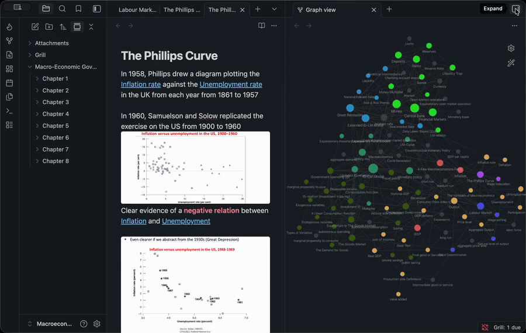
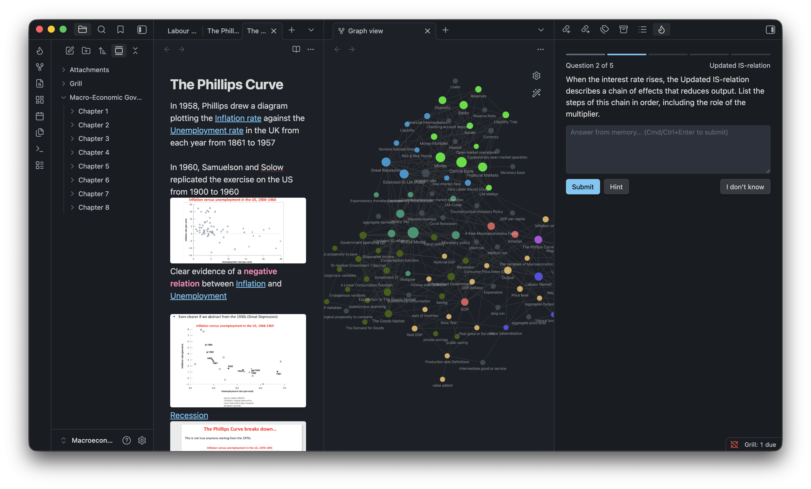
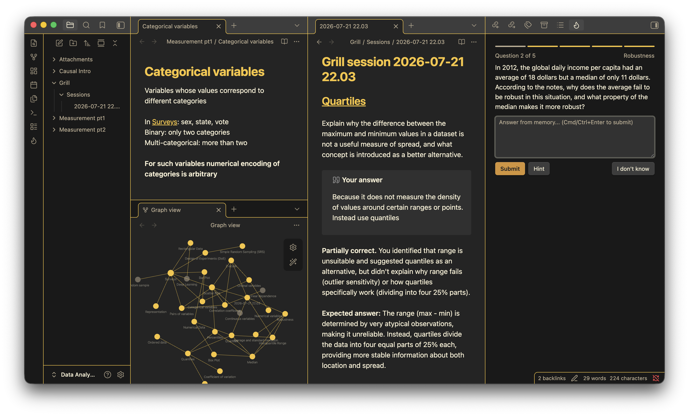

# Grill

I take a lot of notes and almost never go back to them. Re-reading a note isn't the same
as actually remembering it, and I couldn't be bothered to turn everything into flashcards.
So Grill quizzes you on the notes you've already got.

It reads your vault, gets whichever model you point it at (Claude, GPT, Gemini, DeepSeek,
or Ollama on your own machine) to write questions from your notes, and marks what you type
back. It remembers how you did on each note and steers the next session toward the things
you keep missing.



## Using it

Hit the flame icon and start a session. Grill grabs a few notes to quiz you on, weighted
toward the ones you've been getting wrong and the ones due for review. It writes the
questions two at a time so you're not stuck watching a spinner while it makes all of them.
Answer from memory and submit.



The same model marks your answer against a little rubric it wrote when it made the
question. Partial credit is a thing. It's told not to accuse you of a mistake it can't
actually point to, which keeps it from being confidently wrong. When you miss something it
notes down what the misunderstanding was and works that back into a later question on the
same note. Stuck? There are three hints that stop short of the answer, and "I don't know"
just shows you the answer and moves on.



## What it keeps track of

Every note gets its own review schedule. This uses FSRS, the spaced-repetition algorithm
Anki switched to a while back: get a note right and it won't come up again for a while, get
it wrong and it's back next time. All of that (the schedule, your history, the misconception
notes) lives in `Grill/mastery.json` in your vault. Each session also gets saved as a normal
note under `Grill/Sessions/`, linked to whatever it quizzed you on, so a note's backlinks
show its quiz history.

Your API key and the settings sit in the plugin's own data, not scattered through your
notes.

## Telling it how to quiz you

There's a file at `Grill/Instructions.md` (open it from the settings, or the "Open question
instructions" command) where you write, in plain sentences, how you want to be quizzed and
graded. "Prefer numeric problems." "Ask me to explain things in my own words." "Be strict on
terminology." "Accept bullet-point answers." Whatever's there gets folded into every session.
Leave it blank and you get the defaults.

## Colouring the graph by what you know

Switch on "Colour your graph by what you know" and Grill tags each quizzed note with
`grill-status` (known, struggling, or untested) and `grill-due`. Hit "Set up graph colours"
and it wires up the three graph groups for you, so the graph lights up by how well you know
things:

- `["grill-status":known]` green
- `["grill-status":struggling]` red
- `["grill-status":untested]` grey

Dataview and Bases can read the same tags. If you don't want the session notes cluttering
your graph, drop `-path:"Grill/"` into the graph filter.

## Cost and privacy

It only ever talks to the provider you gave a key to. No account, no server of mine in the
middle. Your notes, the questions, and your answers go to that provider so it can do its
thing, which means it costs API tokens: more if you feed it more notes or ask for more
questions, both of which you set.

Ollama is the exception. It runs on your machine, so nothing leaves it. The catch is that
small local models write worse questions than the paid ones. 8B or bigger is fine.

## Worth knowing before you install

- You need an API key, or Ollama installed. There's no free hosted version; I'm not running
  a server.
- It's only as good as your notes. Half-written notes make half-baked questions.
- The grading is a model's opinion, not gospel. It's usually right, but not always, so it
  always shows you the expected answer. Trust yourself over it.
- Local models are the weak link. Good for privacy, not for the best questions.

## Look and feel

Grill borrows your theme's colours and spacing so it doesn't clash. The settings cover the
usual stuff (compact layout, the progress bar, hiding the note name so it doesn't give the
answer away). If you want to fiddle further it exposes a few CSS variables and works with
the Style Settings plugin.

## Install

Look for "Grill" in Settings, Community plugins, Browse.

Or build it yourself:

```sh
npm install
npm run build
```

then drop `main.js`, `manifest.json`, and `styles.css` into `<vault>/.obsidian/plugins/grill/`.

## License

MIT
