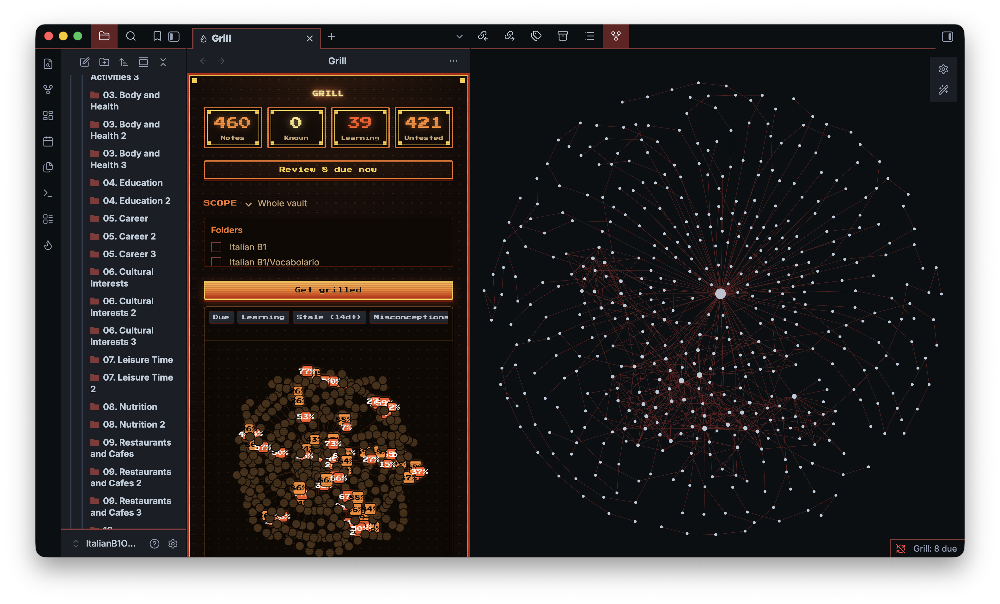
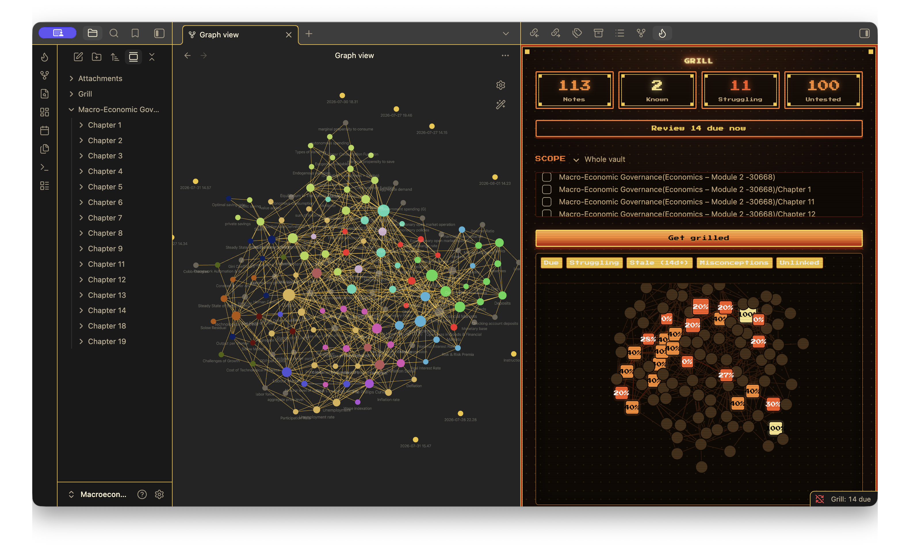

I take a lot of notes to learn new information and needed a system to learn them more deeply. Grill works by creating questions according to the underlying information and your preferences. It then tests you and tracks your knowledge through spaced repition while visualizing your progress in the native knowledge graph. Works using BYOK, fully local, or a mix of both.




## How to use it

1. **Pick what Grill studies.** On first run, tick which folders it should cover, or leave them blank for your whole vault.
2. **Get grilled.** Hit the flame (or **Get grilled**). Grill writes questions from your notes and marks what you type back, with partial credit and specific feedback.
3. **Watch your map fill in.** Every note you've learned colours in on the graph (green for solid, amber for shaky) so you can see your knowledge light up.

Focus a session on a folder or tag from the **Study** dropdown; Grill weights it toward what you keep getting wrong and what's due, and a **Review N due** button drops you straight into what's ready.



## What you get

- **Your key, or fully offline:** Claude, GPT, Gemini, DeepSeek, any OpenAI-compatible endpoint (OpenRouter, Groq, LM Studio), local Ollama, or a no-key deterministic mode. Same engine either way — your model, your cost, your data staying on whichever machine you point it at. No account with Grill, no server of mine in the middle, ever.
- **Questions from your own notes:** the AI writes recall questions from what you actually wrote (or, with no key, straight from your notes' structure).
- **A live map of what you know:** your notes as a graph, coloured and grown by how well you know each. A *learning* graph (what you've proven), distinct from Obsidian's link graph.
- **Fair grading:** answers are marked against a rubric written with the question: partial credit, three hints, and no confidently-wrong nitpicks.
- **Finds links you're missing:** spots notes that belong together but aren't linked, and adds the `[[link]]` for you.
- **Your own questions:** drop a `> [!grill]` callout into any note and Grill asks it verbatim — true/false, multiple-choice, and select-all too, not just free text.
- **Edit a bad question instead of just deleting it:** the pencil on the home screen opens every cached question, grouped by note and searchable, for fixing in place.
- **Reads embedded PDFs:** a `![[worksheet.pdf]]` embed isn't invisible to Grill — it pulls the PDF's text in and quizzes on it like any other note content, worked exercises included.
- **Real spaced repetition:** FSRS scheduling per concept resurfaces what's due; edit a note and only the changed parts re-open.

Full detail on how each of these actually works — scheduling, the knowledge graph, missing-link detection, custom questions, PDFs, persona/instructions — is in **[docs/features.md](docs/features.md)**, not down here.


## Without an API key

You don't need a key to use Grill. In settings, set "Where questions come from" to "From my notes" and "Grading" to "I mark myself", and Grill runs entirely on your machine: it builds questions straight from your notes' own structure (bold terms and highlights become fill-in-the-blanks, headings become recall prompts, "Term: definition" lines and formulas become their own questions), you answer, reveal, and grade yourself Again / Hard / Good / Easy. That rating feeds the same spaced-repetition schedule the AI mode uses. Nothing gets sent anywhere, and there's nothing to pay.

If you've already got flashcards written in your notes, Grill uses them as-is: Spaced Repetition's `==cloze==` and `::`/`?` question separators, and Anki's `{{c1::…}}` clozes (hints and grouped deletions included) all become questions directly.

It's only as good as your notes are structured: definition-heavy, well-headed notes make sharp questions; a wall of prose makes weak ones. When you want questions written about your notes rather than pulled from them, or you want your actual writing marked, point Grill at a model. You can also mix the two, e.g. AI writes the questions and you grade yourself, to halve what a session costs.

## Documentation

- **[docs/features.md](docs/features.md)** — how scheduling, the knowledge graph, missing-link detection, custom questions, PDFs, and persona/instructions actually work.
- **[docs/privacy.md](docs/privacy.md)** — exactly what leaves your machine, where it goes, and what Grill stores.
- **[docs/models.md](docs/models.md)** — which model to use, by budget and by how much RAM your machine has.
- **[docs/troubleshooting.md](docs/troubleshooting.md)** — the mechanics behind the common "is this a bug" questions.

## Worth knowing before you install

- You need an API key, or Ollama installed. There's no free hosted version; I'm not running a server.
- It's only as good as your notes. Half-written notes make half-baked questions.
- The grading is a model's opinion, not gospel. It's usually right, but not always, so it always shows you the expected answer. Trust yourself over it.
- Local models are the weak link. Good for privacy, not for the best questions.

## Requirements

- **Obsidian 1.8.0 or newer.** Grill checks this on load and won't run on an older build.
- **Desktop or mobile** — it's not desktop-only, though writing long answers is obviously easier with a keyboard.
- **One of, depending on how you want to study:**
  - An API key from Anthropic, OpenAI, Google, DeepSeek, or any OpenAI-compatible endpoint (OpenRouter, Groq, LM Studio, ...), for AI-written questions and AI grading.
  - [Ollama](https://ollama.com) installed locally, for the same but fully offline, no key, no cost.
  - Neither: "From my notes" question mode plus self-grading needs no key, no install, no internet, and works entirely from your notes' own structure. See [Without an API key](#without-an-api-key) above.
- No account with Grill itself, ever — there's nothing to sign up for.

## Installation

**From Obsidian (recommended):** Settings → Community plugins → Browse, search "Grill", Install, then Enable. If Community plugins are off, Settings → Community plugins → turn on "Turn on community plugins" first.

**Manual install (a specific version, or before it's live in the community list):** download `main.js`, `manifest.json`, and `styles.css` from a [release](https://github.com/theadamdanielsson/grill/releases) and place all three in `<vault>/.obsidian/plugins/grill/` (create the folder if it doesn't exist), then reload Obsidian and enable Grill in Community plugins. [BRAT](https://github.com/TfTHacker/obsidian42-brat) automates this if you want to track updates without waiting for the community list.

**Build it yourself:**

```sh
npm install
npm run build
```

then drop `main.js`, `manifest.json`, and `styles.css` into `<vault>/.obsidian/plugins/grill/`.

After installing, open Grill (the flame icon, or the "Open Grill" command) — first run asks which folders it should cover.

## Troubleshooting

Short version of the common ones below; the full list, with what's actually happening under the hood, is in [docs/troubleshooting.md](docs/troubleshooting.md).

- **"Couldn't find concepts to quiz in these notes."** The note has too little structure for Grill to pull questions from (no headings, bold terms, definitions, or existing flashcards). Add some structure, or switch questions to AI, which can work from prose.
- **A note I aced doesn't turn green.** Green requires most of a note's individual concepts to each be answered correctly *twice*, spaced out — one lucky pass isn't enough to call it known. See the doc above for why, and what the map's colours actually mean.
- **The same question keeps coming back.** By design: a concept's question is written once and reused verbatim on every later review, never silently reworded — recognizing you've seen this exact sentence before isn't the point, remembering the answer is. If you want a fresh take on a concept, Settings → "Clear cached questions" forces the next review to write a new one.
- **A model isn't reading the images in my notes.** Not every model can — check Settings → "Send images to the model"'s description for which ones can, and Grill now tells you in-session when the model you picked can't.
- **A PDF isn't being quizzed on.** Check it's embedded, `![[file.pdf]]` with the `!`, not just linked. A scanned PDF with no real text underneath (or a password-protected one) has nothing for Grill to extract either — it needs an actual text layer, not just a picture of text.
- **API errors, or grading looks wrong.** Double check the key and model name in settings; a model ID typo is the usual cause. Grading is a model's opinion, not gospel — it's usually right, but the expected answer is always shown so you can judge for yourself.

## Privacy and cost

Grill only talks to the model provider you configure, with your own key — no server of mine in the middle, no analytics, no account. Full breakdown of what leaves your machine and what Grill stores locally: **[docs/privacy.md](docs/privacy.md)**.

## License

MIT
