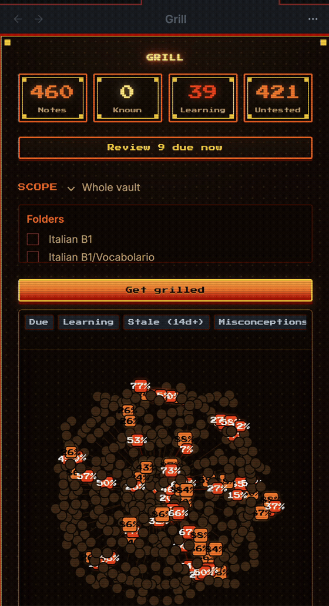
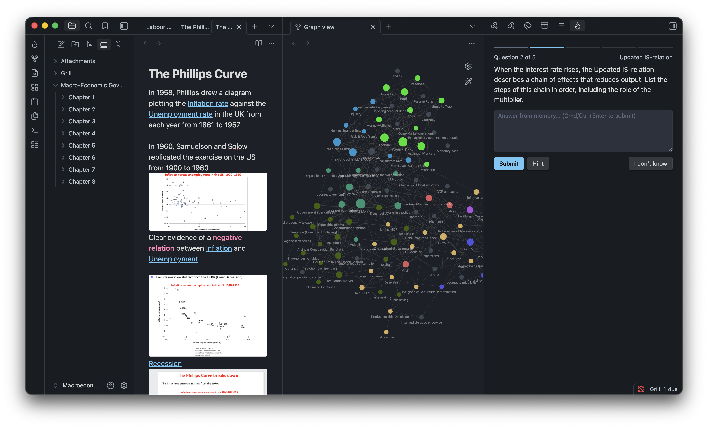
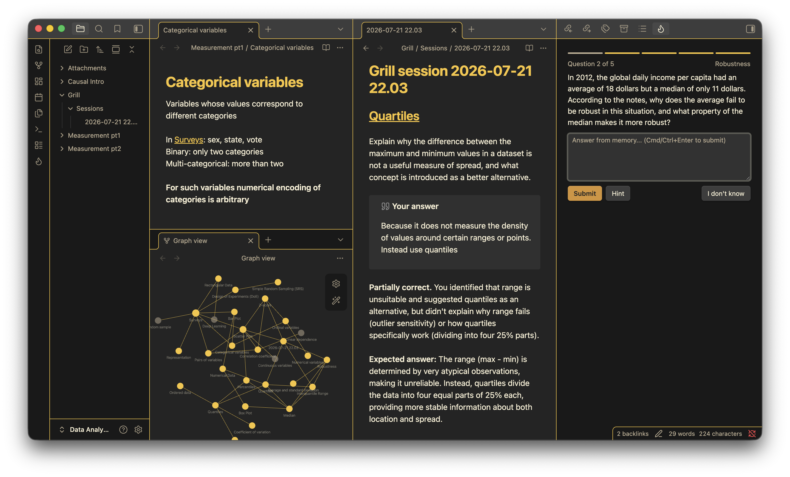

*Grill quizzes you on your own Obsidian notes, marks your answers, and colours in a live map of them as you prove what you know.*

I take a lot of notes and almost never go back to them. Re-reading a note isn't the same as remembering it, and I couldn't be bothered to turn everything into flashcards, so Grill quizzes me on the notes I've already got.



## How to use it

1. **Pick what Grill studies.** On first run, tick which folders it should cover, or leave them blank for your whole vault.
2. **Get grilled.** Hit the flame (or **Get grilled**). Grill writes questions from your notes and marks what you type back, with partial credit and specific feedback.
3. **Watch your map fill in.** Every note you've learned colours in on the graph (green for solid, amber for shaky) so you can see your knowledge light up.

Focus a session on a folder or tag from the **Study** dropdown; Grill weights it toward what you keep getting wrong and what's due, and a **Review N due** button drops you straight into what's ready.



## What you get

- **Questions from your own notes:** the AI writes recall questions from what you actually wrote (or, with no key, straight from your notes' structure).
- **A live map of what you know:** your notes as a graph, coloured and grown by how well you know each. A *learning* graph (what you've proven), distinct from Obsidian's link graph.
- **Fair grading:** answers are marked against a rubric written with the question: partial credit, three hints, and no confidently-wrong nitpicks.
- **Finds links you're missing:** spots notes that belong together but aren't linked, and adds the `[[link]]` for you.
- **Your own questions:** drop a `> [!grill]` callout into any note and Grill asks it verbatim.
- **Real spaced repetition:** FSRS scheduling per concept resurfaces what's due; edit a note and only the changed parts re-open.
- **Your key, or fully offline:** Claude, GPT, Gemini, DeepSeek, any OpenAI-compatible endpoint (OpenRouter, Groq, LM Studio), local Ollama, or a no-key deterministic mode.



## Without an API key

You don't need a key to use Grill. In settings, set "Where questions come from" to "From my notes" and "Grading" to "I mark myself", and Grill runs entirely on your machine: it builds questions straight from your notes' own structure (bold terms and highlights become fill-in-the-blanks, headings become recall prompts, "Term: definition" lines and formulas become their own questions), you answer, reveal, and grade yourself Again / Hard / Good / Easy. That rating feeds the same spaced-repetition schedule the AI mode uses. Nothing gets sent anywhere, and there's nothing to pay.

If you've already got flashcards written in your notes, Grill uses them as-is: Spaced Repetition's `==cloze==` and `::`/`?` question separators, and Anki's `{{c1::…}}` clozes (hints and grouped deletions included) all become questions directly.

It's only as good as your notes are structured: definition-heavy, well-headed notes make sharp questions; a wall of prose makes weak ones. When you want questions written about your notes rather than pulled from them, or you want your actual writing marked, point Grill at a model. You can also mix the two, e.g. AI writes the questions and you grade yourself, to halve what a session costs.

## What it keeps track of

Grill schedules you per concept, not per note. It pulls the concepts out of a note (its headings, definitions, bold terms, formulas, and any flashcards you've already written) and tracks each one on its own. That matters for anything bigger than a one-idea note: a chapter note doesn't count as "known" because you got one lucky question right, it keeps coming back until you've actually been tested across its parts. Each concept rides FSRS, the spaced-repetition algorithm Anki switched to: get it right and it won't come up again for a while, get it wrong and it's back next time. The questions climb in difficulty as you go, easy while a concept is new, harder once you've recalled it a few times spaced out. And if you edit a note, only the concepts you actually changed re-open for review; the rest stay put.

The schedule lives in `Grill/concepts.json`, and your per-note history and the misconception notes in `Grill/mastery.json`, both plain files in your vault. Each session also gets saved as a normal note under `Grill/Sessions/`, linked to whatever it quizzed you on, so a note's backlinks show its quiz history. The "Open progress dashboard" command puts it together: what you keep getting wrong, your coverage per note, and a heatmap of your reviews.

Your API key and the settings sit in the plugin's own data, not scattered through your notes.

## How it adapts

Miss a question and Grill doesn't just mark it wrong and move on. If the note you missed builds on another through your `[[links]]`, and you're shaky on that foundation, Grill pulls it in next, quizzes you on it, and tells you why you were sent there, then carries on where you left off. A wrong answer is a signal about what you're missing underneath, not just a score.

It's also fussy about its own questions. Before one reaches you it's checked for the usual model slop, yes/no questions, hints that give the game away, questions that aren't actually grounded in your note, and quietly dropped if it fails. No extra model call, so it works the same on a local model as on a paid one.

## Links you haven't made yet

Because your notes live in a graph, Grill can also find the links you *haven't* made. In an AI session it looks for two of your notes that clearly belong together but aren't linked, quizzes you on the connection, and offers a one-tap **Link these notes** button that writes the `[[link]]` into the note for you. Answer it and your graph gets a little denser: the AI working *inside* your graph, not beside it. You can turn it off, or change how many it adds per session, in settings.

## Writing your own questions

Sometimes you know exactly what you want to be asked. Drop a callout into any note:

```
> [!grill] Why does IFRS 16 move operating leases on-balance-sheet?
> A: They become a right-of-use asset and a lease liability.
> rubric: mentions right-of-use asset, lease liability, on-balance-sheet
```

Grill asks it verbatim, schedules it alongside everything else, and marks your typed answer against your rubric (or, when you don't write one, against the note). The `A:` and `rubric:` lines are both optional. Because it's a callout it folds away and never clutters your prose, and if you already keep `Question:: answer` flashcards, those still work as they always did.

## Telling it how to quiz you

There's a file at `Grill/Instructions.md` (open it from the settings, or the "Open persona & instructions" command) with two parts. **Persona** is who Grill is and how it talks: the default is shown there, editable, so you can turn it into a strict examiner, a gentle Socratic guide, a blunt drill sergeant, whatever you like. **Instructions** is how you want to be quizzed and graded, in plain sentences: "Prefer numeric problems." "Ask me to explain things in my own words." "Be strict on terminology." "Accept bullet-point answers." Both get folded into every session; leave them blank for the defaults.

Changing the persona only changes Grill's voice. How questions are built and how answers are scored is fixed by the engine, so your grades stay consistent no matter what you write.

## Your knowledge graph

Open Grill and you land on your **knowledge graph**: every note Grill studies, drawn as a map. It starts grey. As you practise, each note colours in by how well you know it (green known, amber shaky) and grows with how durably you know it, and the links between notes you've both learned brighten. It's the same idea as a fill-in-the-map game: you're colouring in your own knowledge by proving you've learned it. Pick a folder or tag and that slice lights up so you can see exactly what a session will cover; finish the session and watch the map change.

This is a *learning* graph (what you've proven), which is a different thing from Obsidian's own graph of what you've written. On first run Grill asks which folders are its territory (leave it blank for the whole vault); change it any time under settings.

## Cost and privacy

It only ever talks to the provider you gave a key to. No account, no server of mine in the middle. Your notes, the questions, and your answers go to that provider so it can do its thing, which means it costs API tokens: more if you feed it more notes or ask for more questions, both of which you set.

Ollama is the exception. It runs on your machine, so nothing leaves it. The catch is that small local models write worse questions than the paid ones. 8B or bigger is fine.

Not sure which model to use, with a key or without? See [docs/models.md](docs/models.md) for recommendations by budget and by how much RAM your machine has.

## Worth knowing before you install

- You need an API key, or Ollama installed. There's no free hosted version; I'm not running a server.
- It's only as good as your notes. Half-written notes make half-baked questions.
- The grading is a model's opinion, not gospel. It's usually right, but not always, so it always shows you the expected answer. Trust yourself over it.
- Local models are the weak link. Good for privacy, not for the best questions.

## Look and feel

Grill borrows your theme's colours and spacing so it doesn't clash. The settings cover the usual stuff (compact layout, the progress bar, hiding the note name so it doesn't give the answer away). If you want to fiddle further it exposes a few CSS variables and works with the Style Settings plugin.

## Install

Look for "Grill" in Settings, Community plugins, Browse.

Or build it yourself:

```sh
npm install
npm run build
```

then drop `main.js`, `manifest.json`, and `styles.css` into `<vault>/.obsidian/plugins/grill/`.

## License

MIT
