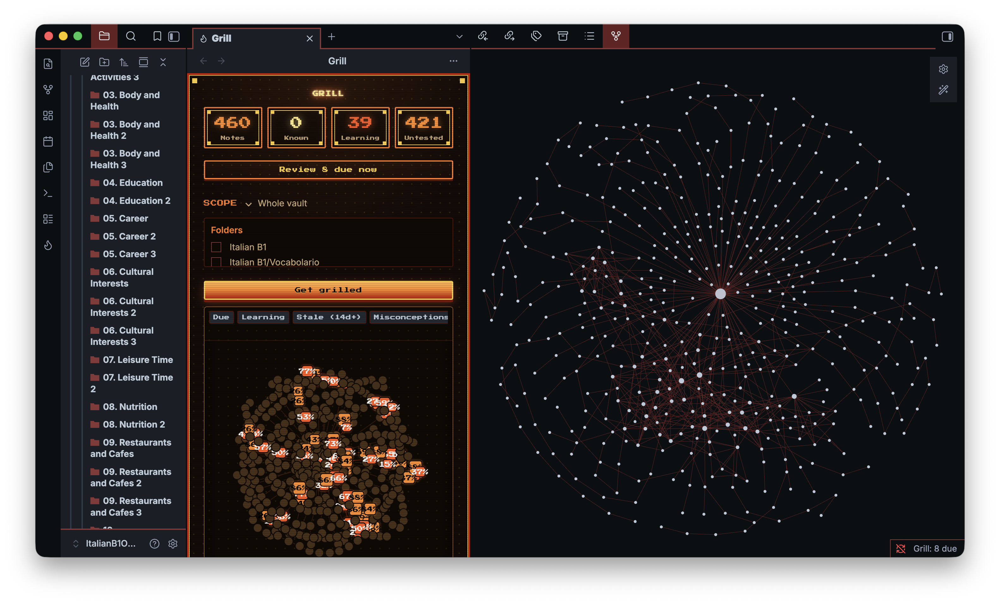
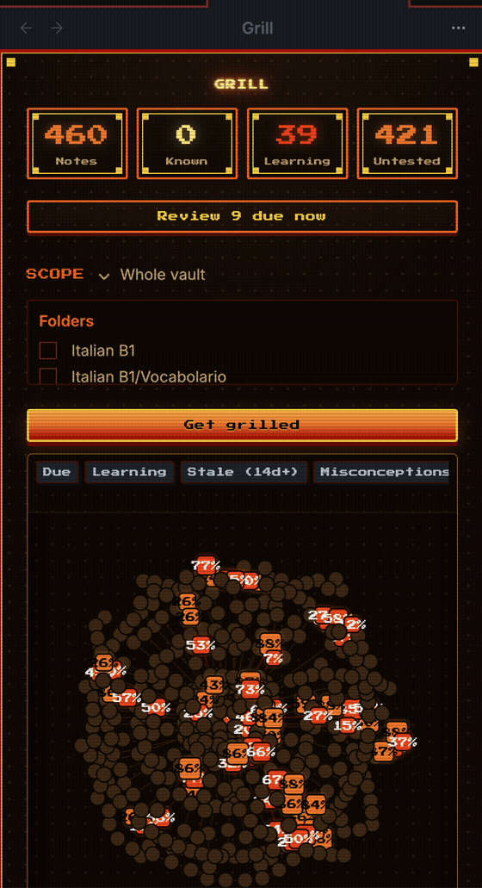
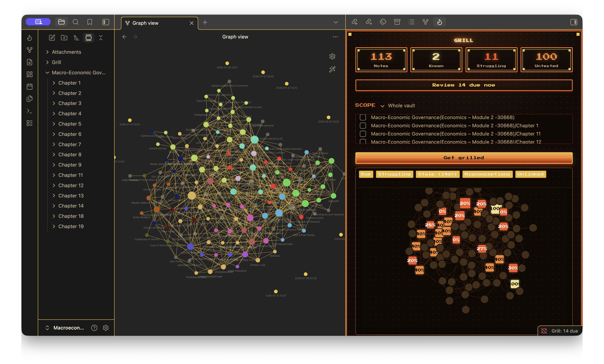
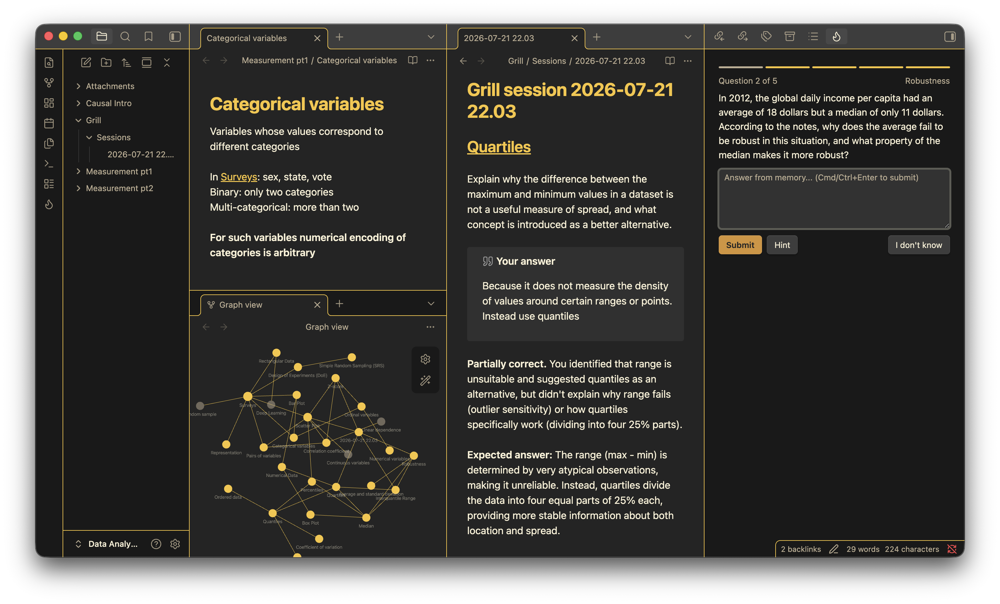
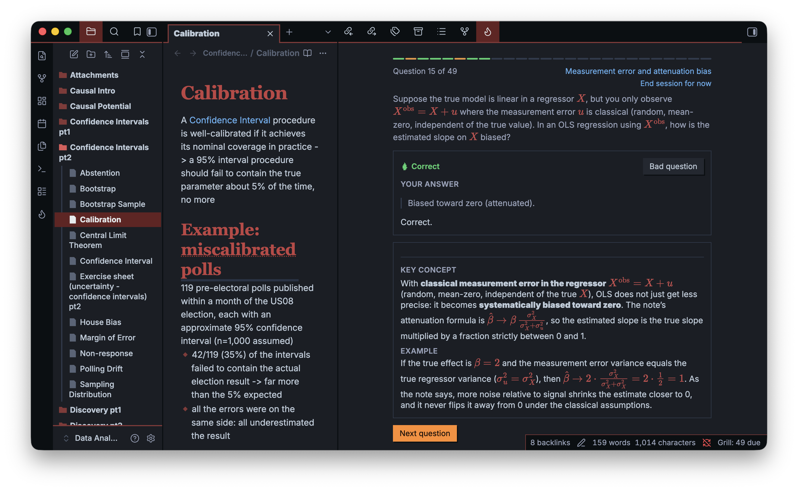

I take a lot of notes to learn new information and needed a system to learn them more deeply. Grill works by creating questions according to the underlying information and your preferences. It then tests you and tracks your knowledge through spaced repetition while showing your progress on a map of your notes. Works using BYOK, fully local, or a mix of both.



<p align="center"></p>

## <picture><source media="(prefers-color-scheme: dark)" srcset="docs/icons/play-dark.svg"></picture> How to use it

1. **Start free.** On first run, press Start free. That's Grill Cloud: no API key, no sign-up, a few free credits to try it. You can use your own API key or Ollama instead, or study fully offline. Then tick which folders Grill should cover, or leave them blank for your whole vault.
2. **Get grilled.** Hit the flame (or **Get grilled**). Grill writes questions from your notes and marks what you type back, with partial credit and specific feedback.
3. **Watch your map fill in.** Every note you've learned colours in on the graph (green for solid, amber for shaky) so you can see your knowledge light up.

Focus a session on a folder or tag from the **Study** dropdown; Grill weights it toward what you keep getting wrong and what's due, and a **Review N due** button drops you straight into what's ready.



##  What you get

- **Nothing to set up:** [Grill Cloud](#grill-cloud) writes and grades your questions with no API key and no account. Free to try.
- **Or your own key, or fully offline:** Claude, GPT, Gemini, DeepSeek, any OpenAI-compatible endpoint (OpenRouter, Groq, LM Studio), local Ollama, or a no-key deterministic mode. Same engine either way — your model, your cost, your data staying on whichever machine you point it at. No account with Grill, and no server of mine in the middle unless you pick [Grill Cloud](#grill-cloud).
- **Questions from your own notes:** the AI writes recall questions from what you actually wrote (or, with no key, straight from your notes' structure).
- **A live map of what you know:** your notes as a graph, coloured and grown by how well you know each. A *learning* graph (what you've proven), distinct from Obsidian's link graph.
- **Fair grading:** answers are marked against a rubric written with the question: partial credit, three hints, and no confidently-wrong nitpicks.
- **Explain this, then keep asking:** one button explains an answer, with a diagram or the image from your note when it helps, and you can ask follow-ups underneath like a chat. It's written into the session note when you finish the session.
- **A natural voice:** questions, feedback and explanations read aloud in a natural AI voice on Grill Cloud or an OpenAI key, or in your device's voice anywhere.
- **Finds links you're missing:** spots notes that belong together but aren't linked, and adds the `[[link]]` for you.
- **Works with the cards you already have:** Spaced Repetition's `==cloze==` and `::`/`?` cards and Anki's `{{c1::…}}` clozes are used as they are.
- **Your notes stay as you wrote them:** the schedule and your history live in their own files under `Grill/`, never inside your notes. Grill only edits a note when you press Link these notes.
- **Your own questions:** drop a `> [!grill]` callout into any note and Grill asks it verbatim — true/false, multiple-choice, and select-all too, not just free text.
- **Edit a bad question instead of just deleting it:** the pencil on the home screen opens every cached question, grouped by note and searchable, for fixing in place.
- **Reads embedded PDFs:** a `![[worksheet.pdf]]` embed isn't invisible to Grill — it pulls the PDF's text in and quizzes on it like any other note content, worked exercises included.
- **Real spaced repetition:** FSRS scheduling per concept resurfaces what's due; edit a note and only the changed parts re-open.

Full detail on how each of these actually works — scheduling, the knowledge graph, missing-link detection, custom questions, PDFs, persona/instructions — is in **[docs/features.md](docs/features.md)**, not down here.





<a name="grill-cloud"></a>
## <picture><source media="(prefers-color-scheme: dark)" srcset="docs/icons/cloud-dark.svg"></picture> Grill Cloud

The easiest way to use Grill. Press Start free and you're studying: Grill Cloud writes the questions, grades your answers and explains them, with no API key and no sign-up. Grill makes a key on your device and, while each day's free credits last, you get some to try it.

After that you buy credits when you want them: 400 for $3.99 or 1,100 for $9.99, plus tax where it applies. You pay once per pack. How many credits a session uses depends on how long your notes are and how much you ask for explanations, and Grill tells you what each finished one used. Credits show up in Grill by themselves a few seconds after you pay, and they don't expire. The checkout is run by Stripe, so the page says "Sold through Link" and your card statement shows Link, not Grill. Buying happens in Grill's settings and nowhere else.

It runs on Claude Sonnet 5.5, the same model Grill recommends for grading.

One thing is different from every other mode, so I'll say it plainly. With Grill Cloud, the notes in a session, the images in them, your answers and your custom instructions go through my server to Anthropic. In the other modes they go straight from your machine to your own provider, or nowhere. My server doesn't keep them. It doesn't store or log your notes, the questions, or your answers. Anthropic keeps them for up to 30 days to watch for abuse and doesn't train on them. If you turn on the natural voice, the text being read aloud goes to OpenAI the same way. What my server does store is a short list, and it's all in the privacy policy.

- [Privacy policy](https://grill.onbridger.com/privacy)
- [Terms](https://grill.onbridger.com/terms)

There's nothing to look after. Grill makes a key on your device when you press Start free, and that key is your balance. Every vault on the same device shares it, and it follows a synced vault to your other devices. If you ever lose them all, email inquiries@onbridger.com from the address you paid with and I'll move your purchased credits to your new install. Settings has the rest under Account, including a Delete account button that erases your balance and usage from my server.

Used credits can't be refunded. Unused ones can if you ask within 14 days. Grill Cloud is for people 18 and over.

## <picture><source media="(prefers-color-scheme: dark)" srcset="docs/icons/key-dark.svg"></picture> With your own key

Prefer to pay a model provider directly? Pick "use my own API key or Ollama" on first run, or choose a provider in settings. Grill works the same on Claude, GPT, Gemini, DeepSeek or any OpenAI-compatible endpoint, and on a local model through Ollama, where nothing leaves your machine. Your notes go straight from your machine to the provider you chose; my server isn't involved. Which model to pick is in [docs/models.md](docs/models.md).

<a name="with-no-ai-at-all"></a>
## <picture><source media="(prefers-color-scheme: dark)" srcset="docs/icons/screen-dark.svg"></picture> With no AI at all

Questions you've already written work without any model. A `> [!grill]` callout is asked exactly as you wrote it, and flashcards in your notes are used as they are: Spaced Repetition's `==cloze==` and `::`/`?` separators, and Anki's `{{c1::…}}` clozes. Grill can also pull simple questions straight from a note's structure (bold terms, headings, "Term: definition" lines). You grade yourself, the same spaced-repetition schedule applies, and nothing is sent anywhere. Set "Study mode" to "Fully offline" in settings. It's a fallback, not the main event: the questions are only as good as your notes are structured, and nothing marks your writing.

## <picture><source media="(prefers-color-scheme: dark)" srcset="docs/icons/page-dark.svg"></picture> Documentation

- **[docs/features.md](docs/features.md)** — how scheduling, the knowledge graph, missing-link detection, custom questions, PDFs, and persona/instructions actually work.
- **[docs/privacy.md](docs/privacy.md)** — exactly what leaves your machine, where it goes, and what Grill stores.
- **[docs/models.md](docs/models.md)** — which model to use, by budget and by how much RAM your machine has.
- **[docs/troubleshooting.md](docs/troubleshooting.md)** — the mechanics behind the common "is this a bug" questions.

## <picture><source media="(prefers-color-scheme: dark)" srcset="docs/icons/ask-dark.svg"></picture> Worth knowing before you install

- For AI questions and grading you need [Grill Cloud](#grill-cloud), your own API key, or Ollama installed. Without any of them, the offline mode still works.
- It's only as good as your notes. Half-written notes make half-baked questions.
- The grading is a model's opinion, not gospel. It's usually right, but not always, so it always shows you the expected answer. Trust yourself over it.
- Local models are the weak link. Good for privacy, not for the best questions.

## <picture><source media="(prefers-color-scheme: dark)" srcset="docs/icons/check-dark.svg"></picture> Requirements

- **Obsidian 1.8.0 or newer.** Grill checks this on load and won't run on an older build.
- **Desktop or mobile** — it's not desktop-only, though writing long answers is obviously easier with a keyboard.
- **One of, depending on how you want to study:**
  - [Grill Cloud](#grill-cloud): nothing to install or sign up for. Press Start free.
  - An API key from Anthropic, OpenAI, Google, DeepSeek, or any OpenAI-compatible endpoint (OpenRouter, Groq, LM Studio, ...), for AI-written questions and AI grading.
  - [Ollama](https://ollama.com) installed locally, for the same but fully offline, no key, no cost.
  - None of those: your own questions and flashcards still work with no AI. See [With no AI at all](#with-no-ai-at-all) above.
- No account with Grill itself, ever — there's nothing to sign up for.

## <picture><source media="(prefers-color-scheme: dark)" srcset="docs/icons/install-dark.svg"></picture> Installation

Website: [grill.onbridger.com](https://grill.onbridger.com)

**From Obsidian (recommended):** Settings → Community plugins → Browse, search "Grill", Install, then Enable. If Community plugins are off, Settings → Community plugins → turn on "Turn on community plugins" first.

**Manual install (a specific version, or before it's live in the community list):** download `main.js`, `manifest.json`, and `styles.css` from a [release](https://github.com/theadamdanielsson/grill/releases) and place all three in `<vault>/.obsidian/plugins/grill/` (create the folder if it doesn't exist), then reload Obsidian and enable Grill in Community plugins. [BRAT](https://github.com/TfTHacker/obsidian42-brat) automates this if you want to track updates without waiting for the community list.

**Build it yourself:**

```sh
npm install
npm run build
```

then drop `main.js`, `manifest.json`, and `styles.css` into `<vault>/.obsidian/plugins/grill/`.

After installing, open Grill (the flame icon, or the "Open Grill" command) — first run asks which folders it should cover.

## <picture><source media="(prefers-color-scheme: dark)" srcset="docs/icons/cross-dark.svg"></picture> Troubleshooting

Short version of the common ones below; the full list, with what's actually happening under the hood, is in [docs/troubleshooting.md](docs/troubleshooting.md).

- **"Couldn't find concepts to quiz in these notes."** The note has too little structure for Grill to pull questions from (no headings, bold terms, definitions, or existing flashcards). Add some structure, or switch questions to AI, which can work from prose.
- **A note I aced doesn't turn green.** Green requires most of a note's individual concepts to each be answered correctly *twice*, spaced out — one lucky pass isn't enough to call it known. See the doc above for why, and what the map's colours actually mean.
- **The same question keeps coming back.** By design: a concept's question is written once and reused verbatim on every later review, never silently reworded — recognizing you've seen this exact sentence before isn't the point, remembering the answer is. If you want a fresh take on a concept, the command palette's "Grill: Clear cached questions" forces the next review to write a new one.
- **A model isn't reading the images in my notes.** Not every model can — Grill sends them automatically to models that support vision, and tells you in-session when the model you picked can't.
- **A PDF isn't being quizzed on.** Check it's embedded, `![[file.pdf]]` with the `!`, not just linked. A scanned PDF with no real text underneath (or a password-protected one) has nothing for Grill to extract either — it needs an actual text layer, not just a picture of text.
- **API errors, or grading looks wrong.** Double check the key and model name in settings; a model ID typo is the usual cause. Grading is a model's opinion, not gospel — it's usually right, but the expected answer is always shown so you can judge for yourself.

Something broken? [Open an issue](https://github.com/theadamdanielsson/grill/issues). A question or an idea? [Start a discussion](https://github.com/theadamdanielsson/grill/discussions).

## Privacy and cost

Grill only talks to the model provider you configure, with your own key. No analytics, no account, and no server of mine in the middle. The one exception is [Grill Cloud](#grill-cloud), if you turn it on: then the session goes through my server to Anthropic. Full breakdown of what leaves your machine and what Grill stores locally: **[docs/privacy.md](docs/privacy.md)**.

## License

MIT

<picture><source media="(prefers-color-scheme: dark)" srcset="docs/fire-dark.svg"></picture>
